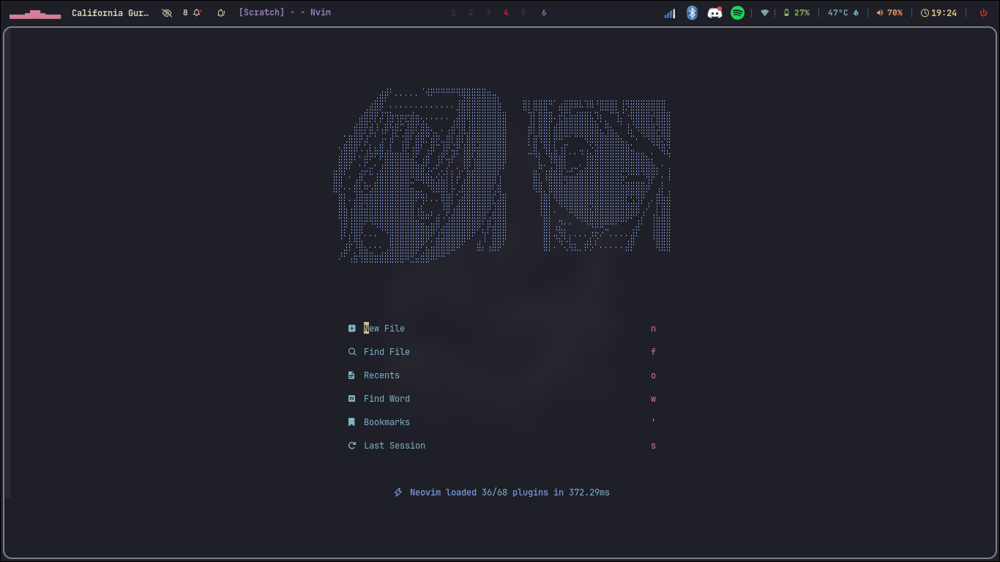
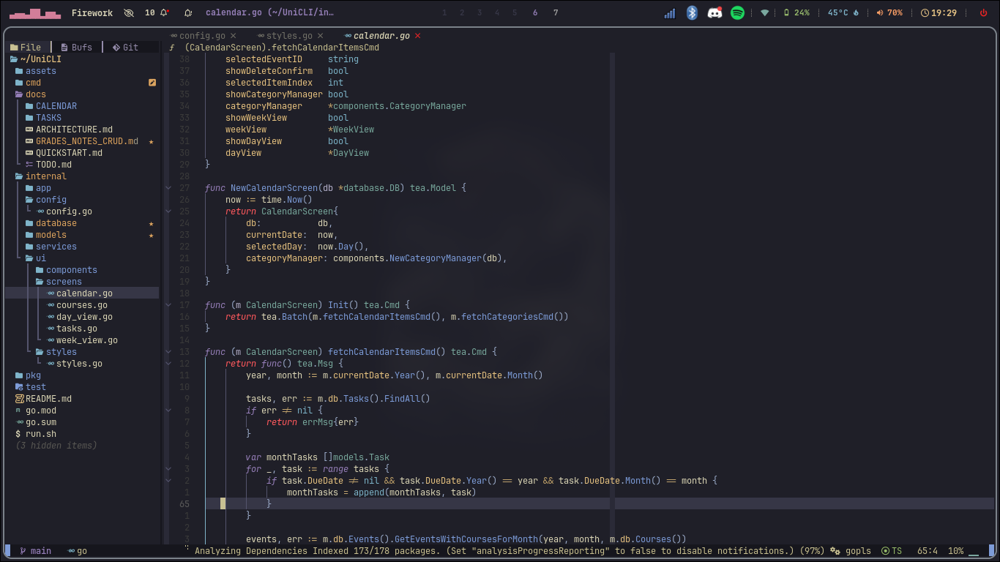
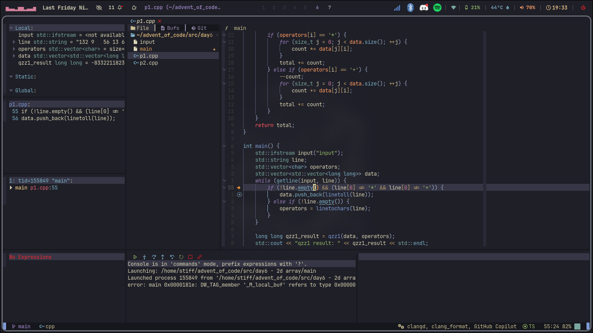
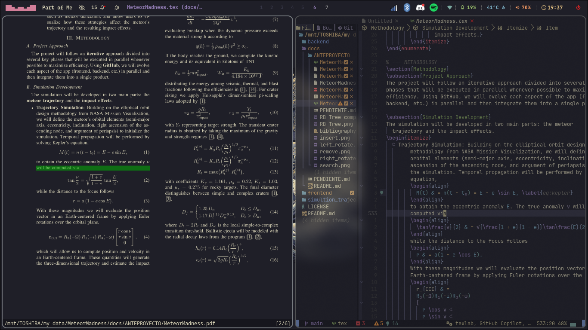

<div align="center">

# 🚀 Stiff's Neovim Configuration

[](https://neovim.io)
[](https://github.com/AstroNvim/AstroNvim)
[](https://www.lua.org/)

_A carefully crafted Neovim configuration built on top of AstroNvim v5_

[Features](#-features) • [Installation](#-installation) • [Plugins](#-plugins) • [Keymaps](#%EF%B8%8F-keymaps) • [Screenshots](#-screenshots)

</div>

---

## ✨ Features

- 🎨 **Beautiful UI** - Kanagawa theme with custom highlights
- 🧠 **Smart Autocompletion** - Blink.cmp with LSP integration
- 📝 **Format on Save** - Conform.nvim for automatic code formatting
- 🔍 **Powerful LSP** - Pre-configured for Go, Python, C/C++, TypeScript, LaTeX, Typst, Java
- 📦 **70+ Plugins** - Carefully selected and optimized
- ⚡ **Fast Startup** - Lazy loading for optimal performance
- 🎯 **Custom Snippets** - Workflow-optimized code snippets
- 🤝 **Live Sharing** - Built-in collaborative editing support
- 📊 **Time Tracking** - Custom timelimit plugin for project deadlines

## 📋 Requirements

- **Neovim** >= 0.10.0 (0.11+ recommended)
- **Git** >= 2.19.0
- A **Nerd Font** ([JetBrainsMono Nerd Font](https://www.nerdfonts.com/) recommended)
- **Node.js** >= 18.0 (for LSP servers)
- **Python** >= 3.10 (for Python LSP)
- **ripgrep** (for telescope grep)
- **lazygit** (optional, for Git integration)
- **zathura** (optional, for LaTeX and Typst PDF preview)
- **typst** (optional, for Typst document compilation)

## 🚀 Installation

### 1️⃣ Backup existing configuration

```bash
mv ~/.config/nvim ~/.config/nvim.bak
mv ~/.local/share/nvim ~/.local/share/nvim.bak
mv ~/.local/state/nvim ~/.local/state/nvim.bak
mv ~/.cache/nvim ~/.cache/nvim.bak
```

### 2️⃣ Clone this repository

```bash
git clone https://github.com/stiffis/neovim-config ~/.config/nvim
```

### 3️⃣ Start Neovim

```bash
nvim
```

Lazy.nvim will automatically install all plugins on first launch.

### 4️⃣ Install LSP servers and tools (optional)

Open Neovim and run:

```vim
:Mason
```

Install the tools you need manually, or let AstroNvim install them automatically when you open files.

## 🔌 Plugins

### Core Framework

- [AstroNvim](https://github.com/AstroNvim/AstroNvim) - Base configuration framework
- [lazy.nvim](https://github.com/folke/lazy.nvim) - Plugin manager

### UI & Themes

- [kanagawa.nvim](https://github.com/rebelot/kanagawa.nvim) - Main colorscheme (dark wave)
- [catppuccin](https://github.com/catppuccin/nvim) - Alternative colorscheme (mocha)
- [render-markdown.nvim](https://github.com/MeanderingProgrammer/render-markdown.nvim) - Beautiful markdown rendering

### Completion & Snippets

- [blink.cmp](https://github.com/Saghen/blink.cmp) - Fast completion engine
- [LuaSnip](https://github.com/L3MON4D3/LuaSnip) - Snippet engine

### LSP & Formatting

- [mason.nvim](https://github.com/williamboman/mason.nvim) - LSP/DAP/Linter installer
- [nvim-lspconfig](https://github.com/neovim/nvim-lspconfig) - LSP configurations
- [conform.nvim](https://github.com/stevearc/conform.nvim) - Code formatter (handles all formatting)
- [nvim-treesitter](https://github.com/nvim-treesitter/nvim-treesitter) - Syntax highlighting

### Language-Specific

- [vimtex](https://github.com/lervag/vimtex) - LaTeX support with live preview
- [typst.vim](https://github.com/kaarmu/typst.vim) - Typst support with syntax highlighting and conceal
- **tinymist** - Typst LSP for autocompletion, diagnostics, and formatting
- [nvim-java](https://github.com/nvim-java/nvim-java) - Java development (via AstroCommunity)
- [tailwind-tools.nvim](https://github.com/luckasRanarison/tailwind-tools.nvim) - TailwindCSS utilities
- [tailwindcss-colorizer-cmp](https://github.com/roobert/tailwindcss-colorizer-cmp.nvim) - Color previews

### Utilities

- [presence.nvim](https://github.com/andweeb/presence.nvim) - Discord Rich Presence
- [live-share.nvim](https://github.com/azratul/live-share.nvim) - Collaborative editing
- **timelimit** - Custom plugin for deadline tracking with progress bars

### Complete plugin list

See [`lua/plugins/`](./lua/plugins/) directory for all plugin configurations.

## ⌨️ Keymaps

### General

| Key       | Mode   | Action           |
| --------- | ------ | ---------------- |
| `<Space>` | Normal | Leader key       |
| `,`       | Normal | Local leader key |

### Completion (blink.cmp)

| Key         | Mode   | Action                                       |
| ----------- | ------ | -------------------------------------------- |
| `<Tab>`     | Insert | Next item / Accept snippet                   |
| `<S-Tab>`   | Insert | Previous item / Previous snippet placeholder |
| `<C-Space>` | Insert | Show completions                             |
| `<C-e>`     | Insert | Hide completions                             |
| `<CR>`      | Insert | Accept completion                            |

### Buffers

| Key          | Mode   | Action                     |
| ------------ | ------ | -------------------------- |
| `]b`         | Normal | Next buffer                |
| `[b`         | Normal | Previous buffer            |
| `<leader>bd` | Normal | Close buffer (with picker) |

### LSP

| Key          | Mode   | Action              |
| ------------ | ------ | ------------------- |
| `gD`         | Normal | Go to declaration   |
| `gd`         | Normal | Go to definition    |
| `K`          | Normal | Hover documentation |
| `<leader>lf` | Normal | Format buffer       |

### LaTeX (VimTeX)

| Key    | Mode   | Action                |
| ------ | ------ | --------------------- |
| `\\ll` | Normal | Compile LaTeX         |
| `\\lv` | Normal | View PDF              |
| `\\lc` | Normal | Clean auxiliary files |

### Typst

#### Compilation & Viewing

| Key   | Mode   | Action              |
| ----- | ------ | ------------------- |
| `,ll` | Normal | Watch & Compile     |
| `,lc` | Normal | Compile once        |
| `,lv` | Normal | View PDF (Zathura)  |

#### Browser Preview (with bidirectional sync)

| Key   | Mode   | Action                      |
| ----- | ------ | --------------------------- |
| `,lp` | Normal | Start preview (browser)     |
| `,lP` | Normal | Stop preview                |
| `,ls` | Normal | Sync preview (forward)      |
| `,lt` | Normal | Toggle follow cursor        |
| `,lF` | Normal | Enable follow cursor        |
| `,ln` | Normal | Disable follow cursor       |

#### LSP Features

| Key   | Mode   | Action              |
| ----- | ------ | ------------------- |
| `,lf` | Normal | Format document     |
| `,lr` | Normal | Rename symbol       |
| `,la` | Normal | Code actions        |
| `,li` | Normal | LSP info            |

#### Diagnostics

| Key   | Mode   | Action              |
| ----- | ------ | ------------------- |
| `,le` | Normal | Open error list     |
| `,lE` | Normal | Close error list    |

All default AstroNvim keymaps are available. Press `<leader>` to see which-key menu.

## 🎨 Customization

### Changing the colorscheme

Edit `lua/plugins/astroui.lua`:

```lua
opts = {
  colorscheme = "kanagawa", -- or "catppuccin"
}
```

### Adding formatters

Edit `lua/plugins/conform.lua`:

```lua
formatters_by_ft = {
  your_language = { "your_formatter" },
}
```

### Installing LSP servers

Open Neovim and run `:Mason`, then install servers manually.

## 📂 Structure

```
~/.config/nvim/
├── init.lua                  # Entry point
├── lua/
│   ├── lazy_setup.lua        # Lazy.nvim configuration
│   ├── polish.lua            # Final polish and autocommands
│   ├── community.lua         # AstroCommunity imports
│   └── plugins/              # Plugin configurations
│       ├── astrocore.lua     # Core AstroNvim config
│       ├── astrolsp.lua      # LSP configuration
│       ├── astroui.lua       # UI configuration
│       ├── copilot.lua       # Copilot setup
│       ├── conform.lua       # Formatting setup
│       ├── treesitter.lua    # Treesitter parsers
│       └── ...               # Other plugin configs
├── .gitignore
├── .stylua.toml              # Lua formatter config
└── README.md                 # This file
```

## 🐛 Troubleshooting

### Plugins not loading

```vim
:Lazy sync
```

### LSP not working

```vim
:LspInfo
:Mason
```

### Formatters not working

```vim
:ConformInfo
```

## 📸 Screenshots

### Dashboard


_Startup screen with custom configuration_

### Coding Experience


_LSP integration with autocompletion and syntax highlighting_

### Debug with DAP


_Debugging session using nvim-dap_

### LaTeX with Zathura


_VimTeX compilation with live PDF preview in Zathura_

## 🤝 Contributing

Feel free to fork and customize for your own use. This is a personal configuration, but suggestions are welcome!

## 📝 License

MIT License - feel free to use this configuration as a starting point for your own setup.

## 🙏 Credits

- [AstroNvim](https://github.com/AstroNvim/AstroNvim) - Amazing Neovim distribution
- [Neovim](https://neovim.io/) - The best text editor
- All plugin authors for their incredible work

---

<div align="center">

**Made with ❤️ and Lua**

[⬆ Back to Top](#-stiffs-neovim-configuration)

</div>
